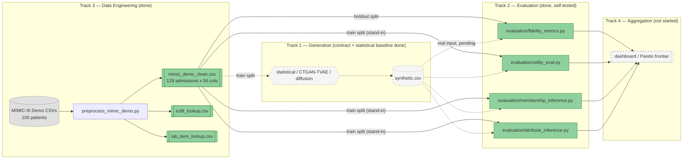

# Project Doppel

**A distributed pipeline for benchmarking synthetic EHR generators on fidelity, utility, and privacy — under one dataset, one protocol, one environment.**


---

## What this is

Doppel trains three families of synthetic Electronic Health Record generators — a statistical baseline, a GAN-family model (CTGAN/TVAE), and a tabular diffusion model — on the MIMIC-III Clinical Database Demo, then scores each one on the same fidelity, downstream-utility, and privacy-attack protocol so the three are actually comparable instead of three incomparable sets of numbers. **The evaluation harness (fidelity, utility, membership-inference, and attribute-inference code) is built and self-validated end-to-end** — it correctly distinguishes a memorizing stand-in generator (0.824 membership-inference AUROC) from a noisy one (0.663 AUROC) before any real generator exists to test it on.

> **Status:** Phase 1 of 4 (Weeks 1–2 of a 14-week plan). Data engineering and evaluation tracks are done for this phase. Generative modeling has its generator contract, statistical baseline, CTGAN and TVAE in place; the diffusion model is Track 1's Phase 2 build in progress. Results 2–4 were produced by running the evaluation code against **real data used as a synthetic-data stand-in**. Results 5–6 are real synthetic data.

---

## Architecture



The evaluation stage (green) is fully wired and validated using the real holdout split as a synthetic-data stand-in — the dashed edges show exactly where real generator output will plug in later with no code changes. The generation and aggregation stages (grey, dashed) are the two pieces that don't exist yet, so right now the pipeline has a working middle with no ends attached.

---

## The problem

Hospitals want to share patient data for research without violating privacy, and synthetic data generation is the usual answer — but published evaluations of synthetic EHR generators are inconsistent: different studies use different attack models and different downstream tasks, so results can't be compared across papers. That fragmentation is concrete, not abstract: building this pipeline's own attribute-inference test on a 100-patient, 129-admission demo dataset immediately produced a 43% single-class skew in the holdout split (`HISPANIC/LATINO - PUERTO RICAN` — 15 of 35 holdout admissions, 0 of 94 train admissions), a direct instance of the small-sample, rare-category problem the literature flags as unresolved for high-dimensional clinical data. Doppel fixes one dataset, one protocol, and one environment so the three generator families are graded on identical, reproducible terms.

---

## How it works

| Layer | What it does |
|---|---|
| Data Prep (Track 3) | Loads 7 MIMIC-III Demo tables, builds one row per hospital admission (demographics, labs, ICD-9 codes, LOS), splits 80/20 by patient to avoid leakage, and writes a single clean CSV plus two lookup tables. |
| Generation (Track 1) | Encodes the `train` split into one shared 110-column modeling frame (ICD-9 codes as multi-hot plus a rare-code tail), fits a generator on it, and decodes the samples back to the exact schema of the cleaned CSV. Every output is checked against a written contract before it's saved. The statistical baseline (Gaussian copula), CTGAN and TVAE are built, and hyperparameters are chosen inside train with a memorization check (DCR). The diffusion model is in progress. |
| Evaluation (Track 2) | Scores any dataset matching that schema on fidelity (JS divergence, correlation preservation, KS tests), downstream utility (train-on-synthetic/test-on-real AUROC), and privacy (shadow-model membership inference, attribute inference). |
| Aggregation (Track 4) | *Not built yet.* Will collect all evaluation output and render the fidelity–utility–privacy Pareto frontier on a dashboard. |

---

## Results

### 1. Clean, leakage-safe dataset (Track 3)

| Stage | Value |
|---|---|
| Source | MIMIC-III Clinical Database Demo v1.4, 100 patients |
| Output rows | 129 hospital admissions |
| Output columns | 56 |
| Train / holdout split | 94 / 35 admissions, split by `subject_id` (patient-level, not admission-level) |
| Random seed | 42 (fixed, documented) |

> **Honest scope:** this is real data, cleaned — no synthetic data exists yet. The patient-level split is leakage-safe but, on only 100 patients, produces the ethnicity skew described above. See [`schema_and_feature_dictionary.md`](schema_and_feature_dictionary.md) for the full known-issues list.

### 2. Fidelity metrics — implemented and self-tested

Measured real `train` split vs. real `holdout` split (i.e. the harness's own noise floor, not any generator's fidelity):

| Metric | Value | Protocol threshold |
|---|---|---|
| Mean Jensen–Shannon divergence (49 columns) | 0.1001 | ≤ 0.10 good, ≤ 0.20 acceptable |
| Correlation preservation (mean abs. diff) | 0.2025 | ≤ 0.10 good, ≤ 0.20 acceptable |
| KS test pass fraction (p ≥ 0.05) | 65.22% | reported, not gated |

> **Note:** these numbers measure real-vs-real sampling noise on a 94/35 split, not a generator's fidelity to real data. The correlation-preservation figure landing right at the edge of "acceptable" is itself informative — it shows how much apparent fidelity loss this dataset's small sample size alone produces, before any generator is even involved.

### 3. Downstream utility pipeline (TRTR vs. TSTR) — implemented and self-tested

| Classifier | TRTR AUROC (5-fold CV, real train) | TSTR AUROC (stand-in "synthetic" → real holdout) | Gap |
|---|---|---|---|
| Logistic Regression | 0.5778 | 0.4885 | 0.0893 |
| Random Forest | 0.7373 | 0.8851 | −0.1478 |

> **Honest scope:** "TSTR" here trains on the real `train` split standing in for synthetic data, so this validates the pipeline's plumbing (feature encoding, imputation, scaling, AUROC scoring), not any generator's utility preservation. The Random Forest's TSTR score beating its own TRTR baseline is a symptom of that stand-in setup (small holdout, single train/test draw), not evidence that a generator works. Full protocol: [`eval_protocol.md`](eval_protocol.md#3-downstream-utility-metric).

### 4. Privacy attacks — implemented and self-validated

**Membership inference** (shadow-model attack, 8 shadow models, leave-one-shadow-out evaluation):

| Stand-in generator | Attack AUROC | Interpretation |
|---|---|---|
| Memorizing (noise_scale = 0.0) | 0.8237 | Harness correctly detects strong membership leakage |
| Noisy (noise_scale = 0.3) | 0.6630 | Harness correctly shows leakage drops with added noise |

**Attribute inference** (target: `ethnicity`, attacker = Random Forest trained on stand-in "synthetic" data):

| Metric | Value |
|---|---|
| Attacker accuracy | 0.5143 |
| Base-rate accuracy (majority class) | 0.5143 |
| Uplift | 0.0000 |

> **Note:** the 0.0000 uplift is not evidence of good privacy — it's because the attacker never saw the `HISPANIC/LATINO - PUERTO RICAN` class in training (0 of 94 train rows) and predicted the majority class every time. This is a documented data-split artifact, not a generator property. See [`eval_protocol.md`](eval_protocol.md#attribute-inference-implemented--attribute_inferencepy) for the full writeup.

### 5. Statistical baseline generator (Track 1): first real synthetic data

Gaussian copula and the independent-marginals reference floor, fit on the 94 train rows and scored with Track 2's unmodified fidelity and utility code:

| Arm | Mean JSD vs train | Corr. diff vs train | TSTR AUROC, LR (20 seeds) | TSTR AUROC, RF (20 seeds) |
|---|---|---|---|---|
| `independent_marginals` (floor) | 0.017 | 0.160 | 0.468 ± 0.196 | 0.537 ± 0.181 |
| `gaussian_copula` | 0.016 | 0.132 | 0.547 ± 0.175 | 0.589 ± 0.145 |

> **Honest scope:** both outputs pass the generator contract and reproduce byte for byte from their seed. The copula preserves more correlation than the floor, but its utility lead sits inside a seed-to-seed spread of about 0.2 AUROC. On a single seed, the floor, which has no feature-label signal at all, scored above the TRTR ceiling. That's why generators are reported over seeds (ADR-012). Full writeup, including three caveats on the current metrics: [`docs/baseline_generator_result.md`](docs/baseline_generator_result.md).

### 6. Initial generator sweep (Track 1): memorization vs fidelity, inside train only

165 fits (11 configs × 3 seeds × 5 patient folds). Each generator fits on 4/5 of train and is checked for copying against the unseen fifth. The holdout is never read.

| Generator (best or least-bad config) | DCR ratio (1 = as novel as real) | Near-copy rate (~0.05 = none) | Mean JSD | Corr. diff |
|---|---|---|---|---|
| `independent_marginals` (floor) | 1.099 | 0.005 | 0.020 | 0.175 |
| `gaussian_copula`, λ = 0.25 | 1.037 | 0.021 | 0.020 | **0.119** |
| `ctgan`, 300 epochs | 1.175 | 0.001 | 0.103 | 0.177 |
| `tvae`, 300 epochs | **0.719** | **0.519** | 0.117 | 0.134 |

> **Honest scope:** these are selection numbers measured in-sample, not the Phase 3 holdout benchmark. At 94 training rows the copula leads. CTGAN copies nothing but underfits below the independent floor, and TVAE collapses onto a subset of patients, with half its rows near-copies. Full writeup and the failure-mode checks: [`docs/sweep_result.md`](docs/sweep_result.md).

---

## Honest limitations

- **The diffusion generator doesn't exist yet.** The statistical baseline, CTGAN and TVAE are built. The diffusion model is Track 1's in-progress Phase 2 build. Results 2–4 validate the evaluation code, and Results 5–6 are real synthetic data.
- **The modeling frame is wider than the data.** 110 modeled columns against 94 training rows (d > n) means any flexible generator can memorize the training set.
- **No orchestration exists yet.** Track 4's Docker/Kubernetes pipeline and dashboard haven't started — the project is currently 6 standalone Python scripts run manually, not the containerized system the blueprint describes.
- **The demo dataset is small and skewed.** 100 patients produces a train/holdout split where at least one ethnicity category is entirely absent from `train` — this affects attribute-inference validity and will likely affect Track 1's generator training too.
- **6 lab-value cells are null** across 3 lab columns (Calcium, Magnesium, Phosphate); the utility pipeline median-imputes them, but that choice hasn't been validated against alternatives.
- **No automated test suite.** Validation so far is manual script runs plus printed sanity checks (e.g. the memorizing-vs-noisy membership-inference comparison), not `pytest` coverage.
- **No CI/CD.** Nothing runs automatically on push.
- **This is a course project** (Big Data Analysis) on a 14-week plan started 2026-09-17 — scope and deadlines may still shift.

---

## Repository structure

```
.
├── evaluation/                       # Track 2: fidelity, utility and privacy evaluation
│   ├── fidelity_metrics.py           #   JS divergence, correlation preservation, KS tests
│   ├── utility_eval.py               #   train-on-synthetic / test-on-real utility pipeline
│   ├── membership_inference.py       #   shadow-model membership attacks (numeric, Gower, ICD-9 codes)
│   ├── attribute_inference.py        #   attribute-inference attack, reported as a member gap
│   ├── eval_runner.py                #   scores one synthetic CSV, writes contract JSON to results/
│   ├── summarize_results.py          #   mean +/- sd per generator over seeds
│   ├── pareto.py                     #   fidelity / utility / privacy Pareto frontier
│   ├── mia_calibration.py            #   ceiling and floor controls for the membership attack
│   └── mia_direct_check.py           #   direct attack on the synthetic files, with intervals
├── generators/                       # Track 1: generators, shared codec, contract, model selection
│   ├── codec.py                      #   real CSV <-> the 110-column modeling frame all generators share
│   ├── copula.py                     #   Gaussian copula baseline + independent-marginals floor
│   ├── ctgan_tvae.py                 #   CTGAN and TVAE on the shared modeling frame
│   ├── diagnostics.py                #   in-train memorization check (patient folds, DCR)
│   ├── sweep.py                      #   hyperparameter sweep over folds and seeds, in parallel
│   ├── validate.py                   #   Stage 2 output-contract checker
│   ├── generate.py                   #   Stage 2 entry point (fit, sample, decode, validate, write)
│   └── requirements-neural.txt       #   root requirements.txt + torch/ctgan for the neural generators
├── preprocess_mimic_demo.py          # Track 3: raw MIMIC-III Demo CSVs -> cleaned admission-level dataset
├── schema_and_feature_dictionary.md  # Track 3: data schema, feature dictionary, known data-quality issues
├── contracts/                        # Track 4: integration contracts and JSON schemas between stages
├── docker/                           # Track 4: base image and smoke test
├── k8s/                              # Track 4: namespace and smoke-test Job
├── docs/                             # component docs (A1, A2, B1, B2, C1), result docs, problems_and_decisions.md
├── output/
│   ├── mimic_demo_clean.csv          # cleaned dataset (129 admissions x 56 cols)
│   ├── icd9_lookup.csv               # ICD-9 code -> description lookup (14,567 codes)
│   ├── lab_item_lookup.csv           # lab item ID -> name lookup (top 20 labs)
│   ├── synthetic/                    # generator output + manifests (regenerated from seed, not committed)
│   └── sweeps/                       # sweep tables (regenerated, not committed)
├── results/                          # evaluation JSON per generator and seed (regenerated, not committed)
├── eval_protocol.md                  # Track 2: fidelity/utility/privacy formulas and thresholds
├── requirements.txt                  # pinned dependency versions (the Docker image installs this)
├── Doppel_Blueprint.pdf              # original project spec: architecture, phases, tracks
│   (and Doppel_Blueprint.docx)
├── LICENSE                           # MIT, for the code
├── DATA_LICENSE.md                   # ODbL 1.0, for MIMIC-III-derived data
└── .gitignore                        # excludes raw MIMIC-III source tables, venv, generated data
```

Track 4's multi-stage pipeline wiring and dashboard don't exist yet; `docker/`, `k8s/` and `contracts/` hold the Phase 1 environment and contracts only. Run every evaluation script from the repo root as `python -m evaluation.<module>`.

---

## Quick start

The cleaned dataset is already committed, so you can see real evaluation output with zero external downloads and no cloud account:

```bash
git clone https://github.com/Ganglet/Doppel.git
cd Doppel
pip install -r requirements.txt

python -m evaluation.fidelity_metrics       # JS divergence / correlation / KS report
python -m evaluation.utility_eval           # TRTR vs TSTR AUROC
python -m evaluation.membership_inference   # shadow-model attack sanity check
python -m evaluation.attribute_inference    # attribute-inference attack

python -m generators.generate --generator gaussian_copula --seed 42   # statistical baseline
python -m generators.validate output/synthetic/gaussian_copula_seed42.csv
```

---

## Reproduce everything else

```bash
# Regenerate the cleaned dataset from raw source (requires manual PhysioNet download —
# MIMIC-III Clinical Database Demo v1.4, no credentialing required:
# https://physionet.org/content/mimiciii-demo/1.4/)
# Place PATIENTS.csv, ADMISSIONS.csv, ICUSTAYS.csv, DIAGNOSES_ICD.csv,
# D_ICD_DIAGNOSES.csv, LABEVENTS.csv, D_LABITEMS.csv in the repo root, then:
python preprocess_mimic_demo.py
```

```bash
# Staging / production / cloud deployment
# [TODO: not applicable yet — Track 4's Docker/Kubernetes orchestration hasn't started]
```

---

## Operational safety

No cloud resources are in use yet — the pipeline is designed to run entirely on a local Kubernetes cluster (minikube/kind) once Track 4 builds it, so there's no cost-teardown concern at this stage. The one safety practice already in place: raw MIMIC-III source tables are excluded via [`.gitignore`](.gitignore) (added 2026-09-17, in the same commit that fixed a data-serialization bug flagged in review), so re-running preprocessing locally never risks committing patient-level source data to a public repository.

---

## Roadmap

| Phase (Weeks) | Track 1 — Generative Modeling | Track 2 — Evaluation | Track 3 — Data Engineering | Track 4 — Systems & Delivery |
|---|---|---|---|---|
| Phase 1 (1–2) | ✅ Generator contract, shared codec, validator, statistical baseline | ✅ Protocol defined, task selected | ✅ Cleaned dataset, schema, `.gitignore` |  ✅ Set up the local Docker and Minikube/Kubernetes environment, Created and tested the base Docker image, Established integration contracts, including shared schemas and file paths, Coordinated generator input/output requirements with other tracks.|
| Phase 2 (3–7) | ✅ CTGAN/TVAE, in-train model selection (DCR), initial sweep, contract reconciled with Track 4 · diffusion in progress | ✅ Fidelity/utility/privacy code (self-tested on stand-in data) | — | ✅ Statistical & CTGAN containerization, Kubernetes Jobs, Streamlit dashboard scaffold, local and Minikube testing. |
| Phase 3 (8–11) | Not started | Blocked on Track 1 output | — | Not started |
| Phase 4 (12–14) | Not started | Not started | Not started | Not started |

---

## Authors

- **Angshuman** — Track 1, Generative Modeling Core (statistical baseline, CTGAN/TVAE, diffusion model; cross-track architecture decisions)
- **Rayyan** (GitHub: Rayyan-mohammed) — Track 2, Privacy & Utility Evaluation (fidelity, utility, and privacy-attack modules; evaluation protocol)
- **Anoushka** (GitHub: AnoushkaSarkar) — Track 3, Data Engineering (MIMIC-III preprocessing, schema, feature dictionary)
- **Anshuman CE** — Track 4, Systems Integration & Delivery (containerization, Kubernetes orchestration, dashboard, final delivery) — not yet started

---

## Documentation index

- [`Doppel_Blueprint.pdf`](Doppel_Blueprint.pdf) — original project spec: architecture, 4 phases, track ownership, success criteria
- [`schema_and_feature_dictionary.md`](schema_and_feature_dictionary.md) — full data schema, feature dictionary, known data-quality issues
- [`eval_protocol.md`](eval_protocol.md) — fidelity/utility/privacy formulas, thresholds, and the ethnicity-split caveat
- [`docs/A1_generative_modeling.md`](docs/A1_generative_modeling.md) — Track 1: generator contract, modeling frame, ICD-9 encoding, diffusion design, literature review
- [`docs/baseline_generator_result.md`](docs/baseline_generator_result.md) — first synthetic data: contract self-tests, fidelity, 20-seed utility, metric caveats
- [`docs/A2_generator_training.md`](docs/A2_generator_training.md) — Track 1 Phase 2: CTGAN/TVAE, in-train model selection, contract reconciliation, diffusion build brief
- [`docs/sweep_result.md`](docs/sweep_result.md) — initial sweep: memorization vs fidelity for every generator config
- [`LICENSE`](LICENSE) / [`DATA_LICENSE.md`](DATA_LICENSE.md) — MIT for code, ODbL 1.0 for MIMIC-III-derived data
