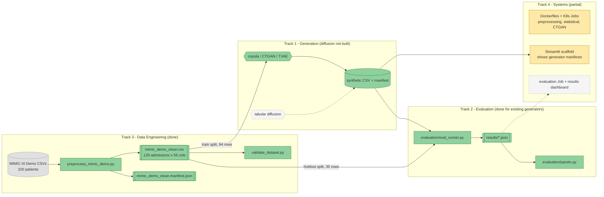

# Project Doppel

**A distributed pipeline for benchmarking synthetic EHR generators on fidelity, utility, and privacy — under one dataset, one protocol, one environment.**


---

## What this is

Doppel trains families of synthetic Electronic Health Record generators on the MIMIC-III Clinical Database Demo — a statistical baseline (Gaussian copula), a GAN-family and a VAE model (CTGAN, TVAE), and a planned tabular diffusion model — and scores every one on the same fidelity, downstream-utility and privacy-attack protocol, so results are comparable instead of being separate numbers from separate papers. Four generator configurations plus a no-dependence floor are built and have been evaluated over 20 seeds each; the diffusion model has not been built. **The privacy attacks are validated against a real generator that memorizes: TVAE scores a worst-case membership AUROC of 0.680 against 0.637 to 0.651 for the other arms (p < 0.0001 for each pair), while a 4-column attack rates it the safest generator of all (0.503).**

> **Status (2026-09-24):** Phase 3 of 4 on a 14-week plan that started 2026-09-17. Data engineering is done through Phase 2 and evaluation through Phase 3, for the generators that exist. Generative modeling has the statistical baseline, CTGAN and TVAE with an initial sweep; the diffusion model is not built. Systems has Dockerfiles, Kubernetes Jobs and a dashboard scaffold for preprocessing and generation, but no evaluation stage, no multi-stage pipeline, and nothing in the repository shows any of it running on a cluster.

---

## Architecture



Green components exist and have been run by their owners' own scripts. Amber (Track 4) exists as files, but nothing in the repository shows it running, and the dashboard reads only generator manifests. Grey, dashed components don't exist. The pipeline's data path from raw CSVs to a Pareto frontier works end to end as separate scripts; what is missing is the diffusion generator and the containerized, orchestrated version of the evaluation stage.

---

## The problem

Hospitals want to share patient data for research without violating privacy, and synthetic data generation is the usual answer — but published evaluations of synthetic EHR generators are inconsistent: different studies use different attack models and different downstream tasks, so results can't be compared across papers. The problem shows up concretely at this project's scale. With 94 training rows and 110 modeled columns, the most flexible generator tried (TVAE) copies 52 to 71% of its rows in Track 1's sweep, and the dataset's own patient-level split leaves one ethnicity group (15 of 35 holdout admissions) absent from train entirely. Doppel fixes one dataset, one protocol, and one environment so the generator families are graded on identical, reproducible terms.

---

## How it works

| Layer | What it does |
|---|---|
| Data Prep (Track 3) | Loads 7 MIMIC-III Demo tables, builds one row per hospital admission (demographics, labs, ICD-9 codes, LOS), splits 80/20 by patient to avoid leakage, and writes a clean CSV, lookup tables, and a manifest checked against a JSON schema. `validate_dataset.py` then checks columns, null patterns, bounds, ICD-9 JSON and patient leakage. |
| Generation (Track 1) | Encodes the `train` split into one shared 110-column modeling frame (ICD-9 codes as multi-hot plus a rare-code tail), fits a generator on it, and decodes back to the exact schema of the cleaned CSV. Every output is checked against a written contract before it's saved. Hyperparameters are chosen inside train, with a distance-to-closest-record memorization check, and never on the holdout. |
| Evaluation (Track 2) | Scores any dataset matching that schema on fidelity (JS divergence, correlation, KS tests), downstream utility (train-on-synthetic, test-on-real AUROC), and privacy (shadow-model membership inference with three attacks, and attribute inference), and writes one contract JSON per generator and seed. Results are read against a ceiling, a floor and a positive control, and summarized as a Pareto frontier. |
| Systems (Track 4) | Dockerfiles and Kubernetes Jobs for preprocessing and for the statistical and CTGAN generators, three JSON schemas that define the contracts between stages, and a Streamlit scaffold that lists generated datasets and their manifests. |

---

## Results

### 1. Clean, validated, leakage-safe dataset (Track 3)

| Stage | Value |
|---|---|
| Source | MIMIC-III Clinical Database Demo v1.4, 100 patients |
| Output rows / columns | 129 hospital admissions / 56 columns |
| Train / holdout split | 94 / 35 admissions, split by `subject_id` (patient-level, not admission-level) |
| Random seed | 42 |
| `python validate_dataset.py` | `VALIDATION PASSED`, 129 rows, 56 columns, all checks green (run 2026-09-24) |

> **Honest scope:** this is real data, cleaned. The patient-level split is leakage-safe but, on 100 patients, leaves `HISPANIC/LATINO - PUERTO RICAN` at 15 of 35 holdout rows and 0 of 94 train rows, which invalidated the original ethnicity attribute attack. The validator catches 7 of 7 faults it was designed for but cannot see this kind of gap (P-018). See [`schema_and_feature_dictionary.md`](schema_and_feature_dictionary.md) for the known-issues list and [`docs/dataset_validation_result.md`](docs/dataset_validation_result.md) for the evidence.

### 2. Generators and in-train model selection (Track 1)

165 fits (11 configs × 3 seeds × 5 patient folds). Each generator fits on 4/5 of train and is checked for copying against the unseen fifth. The holdout is never read.

| Generator (best or least-bad config) | DCR ratio (1 = as novel as real) | Near-copy rate (~0.05 = none) | Mean JSD | Corr. diff |
|---|---|---|---|---|
| `independent_marginals` (floor) | 1.099 | 0.005 | 0.020 | 0.175 |
| `gaussian_copula`, λ = 0.25 | 1.037 | 0.021 | 0.020 | **0.119** |
| `ctgan`, 300 epochs | 1.175 | 0.001 | 0.103 | 0.177 |
| `tvae`, 300 epochs | **0.719** | **0.519** | 0.117 | 0.134 |

> **Honest scope:** these are in-sample selection numbers, not the holdout benchmark. At 94 training rows the copula leads, CTGAN copies nothing but underfits below the independent floor, and TVAE collapses onto a subset of patients. Track 1's next sweep tests smaller networks and stronger regularization, so the neural configs may change. Writeup and failure-mode checks: [`docs/sweep_result.md`](docs/sweep_result.md).

### 3. Full evaluation, five arms × 20 seeds (Track 2)

Fidelity is against real train; utility is train-on-synthetic, test on the 35-row holdout (`hospital_expire_flag`); mean over 20 seeds. Real-data reference for utility: TRTR AUROC 0.737 (random forest).

| Arm | Mean JSD | Corr. diff | TSTR AUROC (RF) | Worst-case membership AUROC | Gower TPR at 1% FPR (chance 0.01) |
|---|---|---|---|---|---|
| `independent_marginals` | 0.0162 | 0.1629 | 0.480 | 0.638 | 0.014 |
| `gaussian_copula` | 0.0165 | 0.1376 | 0.599 | 0.645 | 0.019 |
| `gaussian_copula_shrink025` | 0.0165 | 0.1098 | 0.684 | 0.651 | 0.038 |
| `ctgan` | 0.0937 | 0.1653 | 0.546 | 0.637 | 0.013 |
| `tvae` | 0.1063 | 0.1224 | **0.738** | **0.680** | **0.058** |

> **Honest scope:** TVAE reaches the real-data utility ceiling because it copies training rows, so that number is not evidence it preserves utility. CTGAN's fidelity, utility and privacy are indistinguishable from the no-dependence floor apart from much worse marginals. The 0.25-shrinkage copula matches TVAE on utility (RF p = 0.25) with about 6× better fidelity and less leakage. The neural configs are untuned, the diffusion model is missing, seeds resample generators and not patients, and every p-value is uncorrected. Full table and tests: [`docs/full_evaluation_result.md`](docs/full_evaluation_result.md).

### 4. Privacy attacks validated against a memorizing generator (Track 2)

Shadow-model AUROC over 8 shadow generators, 20 seeds. The ceiling is a generator that returns its training rows, and the floor returns real rows it never saw.

| Arm | 4 numeric columns | Gower, all columns | ICD-9 code sets | Gower TPR at 1% FPR |
|---|---|---|---|---|
| Ceiling (exact copy) | 1.000 | 1.000 | 1.000 | 1.000 |
| Floor (unseen real rows) | 0.502 | 0.503 | 0.489 | 0.009 |
| `gaussian_copula` | 0.515 | 0.585 | 0.645 | 0.019 |
| `ctgan` | 0.507 | 0.541 | 0.637 | 0.013 |
| `tvae` | 0.503 | **0.649** | **0.680** | **0.058** |

> **Honest scope:** this is one positive control on one small dataset. Codes seen only once in train leak through every generator (AUROC 0.82 to 0.84 against a 0.48 floor, including CTGAN), so that channel belongs to any generator that emits codes it saw. TVAE additionally leaks through ordinary rows, because its output sits nearest to only 31 of the 94 training rows (others 40 to 47). A direct attack on the generator fit on all 94 rows has no valid non-members and can't confirm these numbers. An AUROC near 0.5 means these attacks found nothing, not that the data is safe. See [`docs/positive_control_result.md`](docs/positive_control_result.md) and the [literature survey](docs/membership_inference_survey.md).

### 5. Pareto frontier over fidelity, utility and privacy (Track 2)

All five arms are on the frontier (bootstrap frequency 0.81 to 0.97, no pairwise dominance probability above 0.16), so the frontier shows trade-off directions and does not rank the generators. Two checks make that concrete: without the utility axis TVAE's frontier frequency falls to 0.00, and with a 4-column privacy axis it would rise to 0.98, which is why the privacy axis is the worst case over three attacks. See [`docs/full_pareto_result.md`](docs/full_pareto_result.md).

### 6. Systems layer (Track 4)

| Component | What exists in the repository | Status |
|---|---|---|
| Docker images | `docker/base`, `docker/preprocessing`, `docker/statistical`, `docker/ctgan`, `docker/smoke-test` | Files present. Not built or run when this README was written (the Docker daemon was not running) |
| Kubernetes | Namespace `doppel` and Jobs for preprocessing, the statistical generator, CTGAN and a smoke test | Files present, same status. A `minikube` kubectl context exists on this machine but no cluster was running |
| Contracts | `generator_output`, `dataset` and `evaluation_result` JSON schemas, and a path decision recorded 2026-09-20 | `generator_output` approved with amendments; `evaluation_result` is loose, with free-form `fidelity`, `utility` and `privacy` objects |
| Dashboard | 76-line Streamlit app listing `output/synthetic/*.csv` with row counts, column types and the generator manifest | Reads generator manifests only, so it shows none of the evaluation results or the frontier |

> **Honest scope:** there is no evaluation container or Job and no multi-stage pipeline. Reading the Job specs against the scripts they run found six gaps, among them a preprocessing Job that would look for the raw data in the wrong directory, undefined volumes, and generator Jobs whose output is lost with the pod (P-017; [`docs/D2_system_integration.md`](docs/D2_system_integration.md)). The previous version of this README's Track 4 roadmap entry claimed local and minikube testing, which can't be checked from the repository.

---

## Honest limitations

- **The diffusion model doesn't exist.** Track 1 has a design and a build brief in [`docs/A2_generator_training.md`](docs/A2_generator_training.md), and no `generators/diffusion.py`. Every comparison here covers two of the blueprint's three generator families.
- **The neural generators are untuned.** CTGAN and TVAE run at Track 1's initial 300-epoch defaults. His next sweep may change them, and Track 2's results must then be rerun.
- **The dataset validator has a blind spot.** It cannot see categorical levels that appear in the holdout but never in train (P-018).
- **The dataset is tiny.** 94 training rows against 110 modeled columns (d > n), a 35-row holdout with 6 positives, and one ethnicity class missing from train. Seeds resample generators, not patients, so none of the p-values speak to a different sample of patients.
- **Utility differences are mostly noise.** TSTR has a seed sd of 0.09 to 0.20, larger than the original "within 0.10 of TRTR" threshold, so utility is reported, not gated.
- **Attack results are proxies.** They are shadow-model numbers from generators fit on 47 rows, and two survey gaps stay open: a density-based attack and a release-only attacker.
- **No evaluation stage is containerized or orchestrated,** no Kubernetes run is documented, and the Phase 2 Job specs have six gaps found by static review (P-017). The Docker images and Jobs were never built or run when this was written.
- **Owner review is pending on three docs.** `docs/C2_data_validation.md`, `docs/D1_kubernetes_env_setup.md` and `docs/D2_system_integration.md` were written by Track 2 from the repository and the checks it ran, not by their owners.
- **Cost:** a 94-row CTGAN fit takes 48 s alone on the evaluation laptop and about 6.8 minutes with six running together, so the neural arms are slow to evaluate.
- **The neural dependencies are source-available, not open source.** `ctgan` and `rdt` are BUSL-1.1 (non-production use).
- **No automated test suite, no CI, no PR template.** Validation is by the validators and calibration scripts, not `pytest`.
- **This is a course project** (Big Data Analysis) on a 14-week plan started 2026-09-17, so scope and deadlines may still shift.

---

## Repository structure

```
.
├── evaluation/                       # Track 2: fidelity, utility and privacy evaluation
│   ├── arms.py                       #   named generator configurations that are evaluated
│   ├── fidelity_metrics.py           #   JS divergence, correlation preservation, KS tests
│   ├── utility_eval.py               #   train-on-synthetic / test-on-real utility pipeline
│   ├── membership_inference.py       #   shadow-model membership attacks (numeric, Gower, ICD-9 codes)
│   ├── attribute_inference.py        #   attribute-inference attack, reported as a member gap
│   ├── eval_runner.py                #   scores one arm and seed, writes contract JSON to results/
│   ├── summarize_results.py          #   mean +/- sd per arm over seeds
│   ├── pareto.py                     #   Pareto frontier with sensitivity and dominance probabilities
│   ├── mia_calibration.py            #   ceiling, floor and positive-control calibration of the attacks
│   ├── mia_direct_check.py           #   direct attack on the synthetic files, with intervals
│   ├── mia_count_check.py            #   tests a neighbourhood-count attack feature (adds nothing)
│   └── synthetic_coverage.py         #   how many train rows each generator's output sits nearest to
├── generators/                       # Track 1: generators, shared codec, contract, model selection
│   ├── base.py, schema.py            #   generator interface and dataset schema constants
│   ├── codec.py                      #   real CSV <-> the 110-column modeling frame all generators share
│   ├── copula.py                     #   Gaussian copula baseline + independent-marginals floor
│   ├── ctgan_tvae.py                 #   CTGAN and TVAE on the shared modeling frame
│   ├── diagnostics.py                #   in-train memorization check (patient folds, DCR)
│   ├── sweep.py                      #   hyperparameter sweep over folds and seeds, in parallel
│   ├── validate.py                   #   Stage 2 output-contract checker
│   ├── generate.py                   #   Stage 2 entry point (fit, sample, decode, validate, write)
│   └── requirements-neural.txt       #   root requirements + torch/ctgan/rdt for the neural generators
├── preprocess_mimic_demo.py          # Track 3: raw MIMIC-III Demo CSVs -> cleaned admission-level dataset
├── generate_manifest.py              # Track 3: writes the dataset manifest checked against the schema
├── validate_dataset.py               # Track 3: dataset validation checks
├── schema_and_feature_dictionary.md  # Track 3: data schema, feature dictionary, known data-quality issues
├── contracts/                        # Track 4: contract README and three JSON schemas between stages
├── docker/                           # Track 4: base, preprocessing, statistical, ctgan images and a smoke test
├── k8s/                              # Track 4: namespace and Jobs (preprocessing, statistical, ctgan, smoke test)
├── dashboard/                        # Track 4: Streamlit scaffold listing generated datasets and manifests
├── web/                              # Track 2: React results dashboard (Vite), reads web/public/data/dashboard.json
├── docs/                             # component docs (A1, A2, B1-B3, C1, C2, D1, D2), result docs, survey, problems_and_decisions.md
├── output/
│   ├── mimic_demo_clean.csv          # cleaned dataset (129 admissions x 56 cols)
│   ├── mimic_demo_clean.manifest.json  # dataset manifest
│   ├── icd9_lookup.csv               # ICD-9 code -> description lookup (14,567 codes)
│   ├── lab_item_lookup.csv           # lab item ID -> name lookup (top 20 labs)
│   ├── synthetic/                    # generator output, eval copies and shadow-fit cache (regenerated, not committed)
│   └── sweeps/                       # sweep tables (regenerated, not committed)
├── results/                          # evaluation JSON per arm and seed (regenerated, not committed)
├── eval_protocol.md                  # Track 2: metric formulas, thresholds, arms and positive control
├── requirements.txt                  # pinned dependency versions (the Docker images install this)
├── Doppel_Blueprint.pdf              # original project spec: architecture, phases, tracks
│   (and Doppel_Blueprint.docx)
├── LICENSE                           # MIT, for the code
├── DATA_LICENSE.md                   # ODbL 1.0, for MIMIC-III-derived data
└── .gitignore                        # excludes raw MIMIC-III source tables, venvs, generated data and results
```

Run every Python script from the repo root, as `python -m evaluation.<module>` or `python -m generators.<module>`.

---

## Quick start

The cleaned dataset is committed, so you can see the whole data-to-result path in about a minute with no downloads and no cloud account:

```bash
git clone https://github.com/Ganglet/Doppel.git
cd Doppel
pip install -r requirements.txt

python validate_dataset.py                                             # Track 3: dataset checks
python -m generators.generate --generator gaussian_copula --seed 42    # Track 1: fit, sample, validate, write
python -m generators.validate output/synthetic/gaussian_copula_seed42.csv
python -m evaluation.eval_runner --generator gaussian_copula --seed 42 # Track 2: writes results/gaussian_copula_seed42.json
```

---

## Reproduce everything else

```bash
# Regenerate the cleaned dataset from raw source (requires manual PhysioNet download of
# MIMIC-III Clinical Database Demo v1.4, no credentialing needed:
# https://physionet.org/content/mimiciii-demo/1.4/).
# Place PATIENTS.csv, ADMISSIONS.csv, ICUSTAYS.csv, DIAGNOSES_ICD.csv,
# D_ICD_DIAGNOSES.csv, LABEVENTS.csv, D_LABITEMS.csv in the repo root, then:
python preprocess_mimic_demo.py && python generate_manifest.py && python validate_dataset.py
```

```bash
# Neural generators (torch 2.14.0, ctgan 0.12.1, rdt 1.22.0; ctgan and rdt are BUSL-1.1)
pip install -r generators/requirements-neural.txt
python -m generators.generate --generator ctgan --seed 42
python -m generators.sweep --seeds 0 1 2      # Track 1's model-selection sweep; 1,440 s on 6 workers per docs/sweep_result.md
```

```bash
# Full evaluation: five arms x 20 seeds, then summaries, the frontier, and the attack controls.
# CTGAN is slow (48 s per 94-row fit alone, about 6.8 minutes with six running together); use six workers or fewer.
for arm in independent_marginals gaussian_copula gaussian_copula_shrink025 ctgan tvae; do
  for s in $(seq 42 61); do python -m evaluation.eval_runner --generator $arm --seed $s; done
done
python -m evaluation.summarize_results
python -m evaluation.pareto
python -m evaluation.mia_calibration --workers 6
python -m evaluation.mia_direct_check --workers 6
```

```bash
# Containers and Kubernetes. These commands follow the Dockerfiles and Job specs in the repository, but were NOT run
# by the author of this README (the Docker daemon was not running).
docker build -f docker/statistical/Dockerfile -t doppel/statistical:0.1 .
kubectl apply -f k8s/namespace/namespace.yaml
kubectl apply -f k8s/jobs/statistical-job.yaml

# Dashboard scaffold (also not run here)
pip install -r dashboard/requirements.txt
streamlit run dashboard/app.py

# Results dashboard in React (needs Node 20+; see web/README.md)
cd web && npm install && npm run dev
```

---

## Operational safety

No cloud resources are in use. The pipeline is designed to run on a local Kubernetes cluster (minikube or kind), so there is no cost-teardown concern at this stage. Three practices are in place. Raw MIMIC-III source tables are excluded by [`.gitignore`](.gitignore), so re-running preprocessing never risks committing patient-level source data. Generated data, evaluation results and the shadow-fit cache under `output/synthetic/` and `results/` are gitignored and regenerated from seeds. And the evaluation runner always regenerates synthetic data, with cached shadow fits keyed by a hash of the `generators/` source, so an old cached file can't silently mix with new generator code (this bit the project once, P-015).

---

## Roadmap

| Phase (Weeks) | Track 1 — Generative Modeling | Track 2 — Evaluation | Track 3 — Data Engineering | Track 4 — Systems & Delivery |
|---|---|---|---|---|
| Phase 1 (1–2) | ✅ Generator contract, shared codec, validator, statistical baseline, literature review, diffusion design | ✅ Protocol, utility task, literature survey | ✅ Cleaned dataset, schema, feature dictionary, patient-level split | ✅ Base image, K8s namespace and smoke-test Job, draft contracts (no PR template) |
| Phase 2 (3–7) | ✅ CTGAN and TVAE on the interface, in-train selection with memorization check, 165-fit sweep · diffusion not built | ✅ Fidelity, utility and privacy code, runner and contract JSON | ✅ Manifest, validation checks, preprocessing image and Job | ✅ Images and Jobs for the statistical and CTGAN generators, dashboard scaffold · no evaluation Job |
| Phase 3 (8–11) | Not started: diffusion training and final tuning | ✅ Five arms × 20 seeds, calibrated attacks with a positive control, validated Pareto frontier · rerun needed for diffusion and retuned configs | Not started: evaluation-dataset versioning, end-to-end data-flow validation | Branch opened, no commits yet: pipeline wiring, results dashboard, end-to-end test |
| Phase 4 (12–14) | Not started | Not started | Not started | Not started |

---

## Authors

- **Angshuman** — Track 1, Generative Modeling Core (statistical baseline, CTGAN/TVAE, model selection; diffusion model outstanding; cross-track architecture decisions)
- **Rayyan** (GitHub: Rayyan-mohammed) — Track 2, Privacy & Utility Evaluation (fidelity, utility and privacy-attack modules, evaluation runner, attack calibration, Pareto frontier, literature survey)
- **Anoushka** (GitHub: AnoushkaSarkar) — Track 3, Data Engineering (MIMIC-III preprocessing, schema, manifest, dataset validation, preprocessing Job)
- **Anshuman CE** — Track 4, Systems Integration & Delivery (Docker images, Kubernetes Jobs, contracts, dashboard scaffold; pipeline orchestration outstanding)

---

## Documentation index

- [`Doppel_Blueprint.pdf`](Doppel_Blueprint.pdf) — original project spec: architecture, 4 phases, track ownership, success criteria
- [`docs/problems_and_decisions.md`](docs/problems_and_decisions.md) — running log of architecture decisions (ADR-001 to 027) and problems (P-001 to 018)
- [`schema_and_feature_dictionary.md`](schema_and_feature_dictionary.md) — full data schema, feature dictionary, known data-quality issues
- [`docs/C1_data_engineering.md`](docs/C1_data_engineering.md), [`docs/C2_data_validation.md`](docs/C2_data_validation.md) — Track 3 component docs (Phases 1 and 2)
- [`docs/data_pipeline_result.md`](docs/data_pipeline_result.md), [`docs/dataset_validation_result.md`](docs/dataset_validation_result.md) — cleaned-dataset evidence, and validator fault-injection results
- [`docs/D1_kubernetes_env_setup.md`](docs/D1_kubernetes_env_setup.md), [`docs/D2_system_integration.md`](docs/D2_system_integration.md) — Track 4 component docs (Phases 1 and 2), with static checks
- [`docs/A1_generative_modeling.md`](docs/A1_generative_modeling.md) — Track 1: generator contract, modeling frame, ICD-9 encoding, diffusion design, literature review
- [`docs/A2_generator_training.md`](docs/A2_generator_training.md) — Track 1 Phase 2: CTGAN/TVAE, in-train model selection, diffusion build brief
- [`docs/baseline_generator_result.md`](docs/baseline_generator_result.md) and [`docs/sweep_result.md`](docs/sweep_result.md) — first synthetic data, and the 165-fit sweep
- [`eval_protocol.md`](eval_protocol.md) — Track 2 metric formulas, thresholds, arms and positive control
- [`docs/B1_evaluation_pipeline.md`](docs/B1_evaluation_pipeline.md), [`docs/B2_eval_runner.md`](docs/B2_eval_runner.md), [`docs/B3_full_evaluation.md`](docs/B3_full_evaluation.md) — Track 2 component docs, Phases 1 to 3
- [`docs/full_evaluation_result.md`](docs/full_evaluation_result.md), [`docs/positive_control_result.md`](docs/positive_control_result.md), [`docs/full_pareto_result.md`](docs/full_pareto_result.md) — Track 2 Phase 3 results
- [`docs/membership_inference_survey.md`](docs/membership_inference_survey.md) — literature survey, 18 checked sources
- [`contracts/README.md`](contracts/README.md) — contracts between stages, with the path decision
- [`LICENSE`](LICENSE) / [`DATA_LICENSE.md`](DATA_LICENSE.md) — MIT for code, ODbL 1.0 for MIMIC-III-derived data
